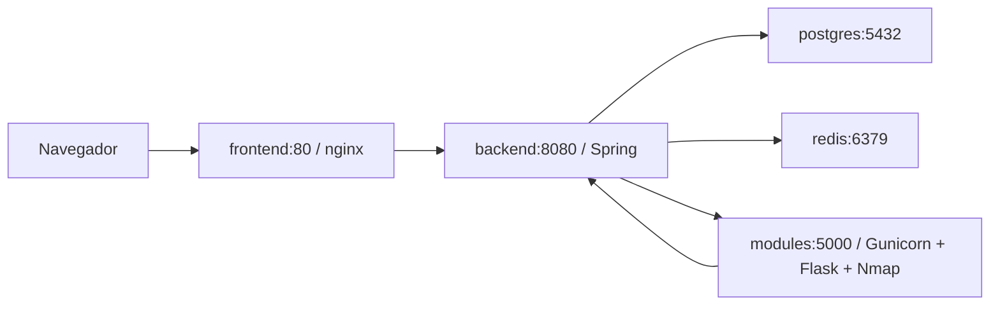

# ReconAC: API y despliegue con Docker

## Requisitos

- Docker Engine con Compose v2 o superior, o Docker Desktop en modo contenedores Linux.
- Acceso a los registros de imágenes, Maven Central, npm y PyPI durante la construcción.
- Para reconocimiento real, conectividad desde el contenedor hacia los objetivos autorizados y hacia NVD/FIRST/CISA. No se requiere una clave NVD global en Compose: cada usuario registra la suya en la aplicación.

El backend usa **Spring Boot 4.1.0, Java 21 y springdoc 3.1.1**, que ya estaba en el proyecto. Se conserva esta combinación: [compatibilidad oficial](https://springdoc.org/faq.html). Actuator se incorpora únicamente para salud de Spring, PostgreSQL y Redis.

## Configurar y ejecutar

Desde la raíz del repositorio (la carpeta que contiene `recon_back`, `recon_front` y `recon_modules`):

```sh
cp .env.example .env
# PowerShell: Copy-Item .env.example .env
```

Completar en `.env` `DB_PASSWD`, `JWT_SECRET` y `NVD_ENCRYPTION_KEY`. El ejemplo deja estos valores vacíos deliberadamente y Compose rechaza valores vacíos. No versionar `.env` ni compartir la salida de `docker compose config` con secretos interpolados.

Para generar un valor aleatorio, usar un gestor de secretos o, con Python instalado, estos comandos y guardar las salidas **solo en el .env privado**:

```sh
# DB_PASSWD y JWT_SECRET: generar un valor independiente para cada uno
python -c "import secrets; print(secrets.token_hex(32))"
# NVD_ENCRYPTION_KEY: 32 bytes aleatorios codificados en Base64
python -c "import secrets,base64; print(base64.b64encode(secrets.token_bytes(32)).decode())"
```

JWT_SECRET debe tener al menos 32 bytes UTF-8. NVD_ENCRYPTION_KEY cifra las claves NVD de usuarios: conservarla junto con los respaldos de PostgreSQL. Cambiarla sin migrar los datos impide descifrar las claves almacenadas. No es una API key de NVD.

```sh
docker compose config --quiet
docker compose up --build
# Segundo plano:
docker compose up --build -d
docker compose ps
docker compose logs --tail=100 backend modules frontend postgres redis
```

Detener conservando contenedores: `docker compose stop`. Detener y quitar contenedores/red: `docker compose down`. El volumen PostgreSQL permanece. **`docker compose down -v` también borra la base**: reservarlo para datos desechables. Un cambio de contraseña en `.env` no cambia automáticamente la contraseña de una base ya inicializada.

## URLs y puertos por defecto

| Recurso | URL |
| --- | --- |
| Frontend | http://localhost:3000 |
| API mediante el proxy | http://localhost:3000/api |
| API directa, solo loopback | http://localhost:8080/api |
| Swagger UI (mismo origen que frontend) | http://localhost:3000/swagger-ui/index.html |
| Swagger UI directo | http://localhost:8080/swagger-ui/index.html |
| OpenAPI JSON | http://localhost:3000/v3/api-docs |
| Salud Spring / DB / Redis | http://localhost:8080/actuator/health |

PostgreSQL (5432), Redis (6379) y Flask (5000) **no publican puertos al host**. Los puertos publicados se cambian con FRONTEND_PORT y API_PORT. FRONTEND_BIND por defecto es 127.0.0.1. Para publicar fuera de la máquina, configurar un proxy HTTPS, COOKIE_SECURE=true y CORS_ORIGINS para el origen real.

## Arquitectura



Compose proporciona la red y DNS por nombre de servicio. El navegador usa `/api`, por lo que no necesita resolver nombres Docker ni una URL Vite embebida en el build. nginx preserva las rutas API, cookies y reportes, y resuelve rutas React con `try_files ... /index.html`. El desarrollo sigue usando Vite y su proxy local existente.

- Backend: builder Maven con JDK 21; runtime JRE 21, usuario sin privilegios, sin Maven. Los tests se verifican por separado: la imagen empaqueta con `maven.test.skip=true` porque la suite heredada contiene fuentes desactualizadas (ver VERIFY.md).
- Python: Python 3.12, dependencias de `requirements.txt` más Gunicorn fijado en `requirements-docker.txt`, Nmap e iputils-ping. [Gunicorn es una opción de despliegue documentada por Flask](https://flask.palletsprojects.com/en/stable/deploying/gunicorn/).
- Frontend: build Node 22 mediante `npm ci`, typecheck y Vite; runtime nginx, sin servidor de desarrollo.
- PostgreSQL 17: volumen `postgres_data`, migraciones Flyway del repositorio y validación Hibernate al arrancar; no se sustituyen por scripts SQL paralelos.
- Redis 7.4: caché desechable sin volumen ni persistencia AOF/RDB.

Los Dockerfile fijan versiones de herramientas/base por release mayor o menor y npm usa su lockfile. Las etiquetas base y los rangos originales de `requirements.txt` pueden recibir parches; no se promete un build idéntico byte a byte. Para un release inmutable, conservar los digests de las imágenes construidas.

## Variables

| Variable | Uso y valor local / Docker |
| --- | --- |
| DB_URL | Override JDBC existente para ejecución local; Compose usa los campos siguientes |
| DB_HOST / DB_PORT | Local: localhost / 5432; Compose: postgres / 5432 |
| DB_NAME / DB_USER | reconac por defecto |
| DB_PASSWD | Obligatoria; convención existente, no se renombra a DB_PASSWORD |
| REDIS_HOST / REDIS_PORT | Local: localhost / 6379; Compose: redis / 6379 |
| MODULES_API_URL | Local: http://localhost:5000; Compose: http://modules:5000 |
| BACKEND_API_URL | Python local: http://localhost:8080; Compose: http://backend:8080; usada para lookup y callbacks |
| JWT_SECRET | Obligatoria, mínimo 32 bytes UTF-8 |
| NVD_ENCRYPTION_KEY | AES de 32 bytes en Base64; conservar con la base |
| COOKIE_SECURE | Local conserva true; Compose HTTP usa false. Usar true con HTTPS |
| CORS_ORIGINS | Lista separada por comas; por defecto http://localhost:3000 |
| CACHE_TTL_HOURS | 24 por defecto |
| RATE_LIMIT_CAPACITY / RATE_LIMIT_REFILL | Configuración local existente, 10 por defecto; se pueden pasar al backend mediante un override de Compose |
| NMAP_CMD | Ejecutable Nmap; Compose utiliza nmap del sistema |
| SEC_NAME / SEC_PASSWD | Se conservan opcionales; la autenticación real usa UserDetailsService y usuarios persistidos |
| FRONTEND_BIND / FRONTEND_PORT / API_PORT | Publicación host: 127.0.0.1 / 3000 / 8080 |

El `.env` raíz lo lee **Compose**. Para ejecutar Java/Python directamente, exportar las variables desde la terminal o configuración del IDE; las aplicaciones no cargan ese archivo automáticamente. Los `localhost` restantes son valores por defecto para ejecución local o health checks del propio contenedor; los enlaces entre servicios en Compose usan DNS interno.

## Nmap y estado de trabajos

El código real ejecuta `-sS` para SYN y `-sC -sV -O` para servicios/OS, además de `ping` previo. Necesita sockets raw. El servicio modules corre como UID 0 con todas las capabilities retiradas salvo **NET_RAW**; no utiliza `privileged: true` ni red host. [Nmap comprueba privilegios en estos modos](https://nmap.org/book/man-misc-options.html). No se alteran sus flags ni la lógica del motor.

Gunicorn usa **un worker**, cuatro hilos y sin preload, porque `_scans` y los buffers de logs viven en memoria del proceso. No aumentar workers ni replicar modules sin rediseñar el almacenamiento de trabajos. Reiniciar o detener el contenedor interrumpe escaneos activos y borra sus logs temporales. Detener el stack una vez finalizados los trabajos.

En Docker Desktop, Nmap se ejecuta desde una VM Linux/NAT; la visibilidad de capa 2, MAC/OS y alcance de objetivos puede diferir de ejecutar Nmap en el host. `localhost` como objetivo apunta al contenedor; para pruebas de la máquina anfitriona existe `host.docker.internal` donde Docker lo soporte. El chequeo ICMP existente requiere respuesta de ping.

Comprobaciones seguras, sin llamar al pipeline completo ni explorar hosts externos:

```sh
docker compose exec modules nmap --version
docker compose exec modules ping -c 1 -W 2 backend
docker compose exec modules nmap -sS -O -n -Pn -p 5000,5001 --max-retries 0 --host-timeout 15s 127.0.0.1
docker compose exec modules python -m pip check
docker compose exec redis redis-cli ping
docker compose exec postgres sh -c 'pg_isready -U "$POSTGRES_USER" -d "$POSTGRES_DB"'
python scripts/verify_stack.py --url http://localhost:3000
```

## Seguridad y lectura de OpenAPI

Swagger y `/v3/api-docs` son navegables sin autenticación. Solo su página recibe una CSP apta para los recursos locales de Swagger; la API mantiene su política restrictiva. No se habilitan endpoints de Actuator adicionales a health ni sus detalles públicos.

En Swagger puede usarse **Authorize → bearerAuth** con el accessToken, o iniciar sesión con el endpoint de login. En sesiones con cookies, Swagger reenvía XSRF-TOKEN como X-XSRF-TOKEN. La cookie access_token tiene precedencia sobre el Bearer en el filtro existente: para probar otro usuario con Bearer, limpiar primero las cookies.

Las operaciones se agrupan en Auth / Usuario, Auditorías, Escaneos, Activos, Métricas / Dashboard, Reportes, Vulnerabilidades e Integración interna. Los contratos provienen de los DTO reales: se mantienen Page, BaseResponse, enums y records anidados. No todos los endpoints usan la misma envoltura. `expiresIn` de refresh sigue expresado en **milisegundos**. Los callbacks usan jobId, mientras que el lookup recibe escaneoId persistido.

`/api/internal/**` conserva su acceso sin JWT/CSRF, requerido por Python. nginx lo bloquea desde la entrada del frontend; se permite entre contenedores. La API directa está vinculada únicamente a loopback del host, pero desde allí sigue siendo accesible: no publicarla directamente en una interfaz pública sin controles adicionales. Estas rutas aparecen en OpenAPI para documentar la integración; su ejecución desde Swagger detrás de nginx devuelve 404 deliberadamente.

No se corrigieron problemas externos al despliegue: por ejemplo, el manejador genérico actual convierte ciertos IllegalArgumentException/ResponseStatusException en 500, aunque algún servicio pretenda un 404. La documentación no promete un código que el servidor no devuelve. Tampoco se añadieron constraints nuevos a DTOs por razones estéticas.
